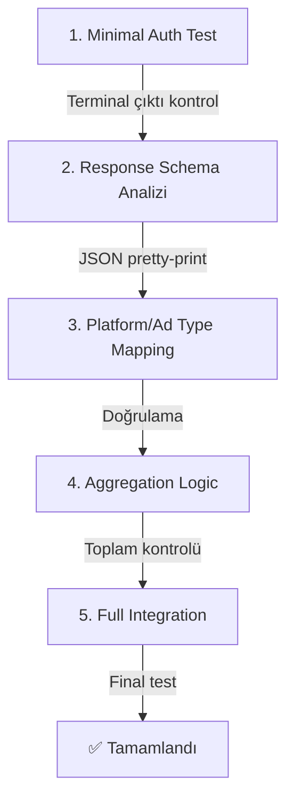

# Network Data Validation System - Skills Guide

Bu döküman, AI agent'ların gerçekleştirebileceği görevlerin detaylı prosedürlerini içerir.

---

# 📋 Skill 1: Network API Döküman Analizi

**Amaç:** Yeni network'ün Reporting API dökümanını analiz ederek fetcher geliştirme için gereken bilgileri çıkarmak.

> ⚠️ **ÖNEMLİ:** API dökümanı analizi fetcher yazımından ÖNCE yapılmalıdır. Eksik veya yanlış analiz, hatalı implementasyona yol açar.

## 📝 Analiz Checklist

### ✅ 1. Base URL ve Endpoint Yapısı
```
□ Base URL nedir? (örn: https://api.network.com/v1)
□ Reporting endpoint path nedir? (örn: /reports/publisher, /analytics/monetization)
□ HTTP method nedir? (GET mi POST mu?)
□ API versiyonu var mı? (v1, v2, etc.)
```

**Çıkarılacak Bilgi:**
```python
BASE_URL = "https://api.network.com"
REPORT_ENDPOINT = "/v1/reports/summary"
HTTP_METHOD = "POST"  # veya "GET"
```

### ✅ 2. Authentication Yöntemi
```
□ Auth tipi nedir?
  □ API Key (header veya query param)
  □ Bearer Token
  □ OAuth 2.0 (client credentials veya authorization code)
  □ Basic Auth (username:password)
  □ Session-based (login → token)
  □ HMAC/Signature based

□ API Key nerede gönderilir?
  □ Header: Authorization: Bearer {token}
  □ Header: X-API-Key: {key}
  □ Query param: ?apikey={key}
  □ Body: {"api_key": "{key}"}

□ Token refresh gerekli mi?
  □ Token süresi ne kadar? (örn: 60 dakika)
  □ Refresh endpoint var mı?
  □ Refresh token mekanizması nasıl?
```

**Çıkarılacak Bilgi:**
```python
AUTH_TYPE = "bearer_token"  # api_key, oauth2, session, basic
AUTH_HEADER = "Authorization"
AUTH_FORMAT = "Bearer {token}"
TOKEN_EXPIRY_MINUTES = 60
REFRESH_ENDPOINT = "/auth/refresh"
```

### ✅ 3. Request Formatı
```
□ Request body formatı nedir?
  □ JSON
  □ Form data
  □ Query parameters
  
□ Zorunlu parametreler neler?
  □ publisher_id / account_id
  □ date_range (start_date, end_date)
  □ dimensions / group_by
  □ metrics

□ Tarih formatı nedir?
  □ YYYY-MM-DD
  □ YYYY-MM-DDTHH:MM:SSZ (ISO 8601)
  □ Unix timestamp (seconds)
  □ Unix timestamp (milliseconds)

□ Tarih aralığı nasıl belirtilir?
  □ start_date / end_date
  □ date_range: {start, end}
  □ since / until
  □ from / to
```

**Çıkarılacak Bilgi:**
```python
DATE_FORMAT = "%Y-%m-%d"
DATE_PARAM_STYLE = "range_object"  # separate_params, range_object, since_until
REQUIRED_PARAMS = ["publisher_id", "date_range", "dimensions"]
```

### ✅ 4. Response Yapısı
```
□ Response formatı nedir?
  □ JSON object
  □ JSON array
  □ CSV
  □ Streaming/chunked

□ Data nerede bulunur?
  □ Root level (response = [...])
  □ data key altında (response.data = [...])
  □ results key altında (response.results = [...])
  □ rows key altında (response.rows = [...])

□ Pagination var mı?
  □ Offset-based (offset, limit)
  □ Cursor-based (next_cursor)
  □ Page-based (page, per_page)
  □ Token-based (next_page_token)
  
□ Response async mı?
  □ Hemen sonuç döner
  □ Job ID döner, sonra poll etmek gerekir
```

**Çıkarılacak Bilgi:**
```python
RESPONSE_DATA_KEY = "data"  # veya "rows", "results", None (root level)
PAGINATION_TYPE = "none"  # offset, cursor, page, token
IS_ASYNC = False
```

### ✅ 5. Metric ve Dimension Alanları
```
□ Revenue alanı adı nedir?
  □ revenue
  □ earnings
  □ estimated_earnings
  □ publisher_revenue

□ Revenue birimi nedir?
  □ USD (tam değer)
  □ Micros (1,000,000'a böl)
  □ Cents (100'e böl)

□ Impressions alanı adı nedir?
  □ impressions
  □ impr
  □ ad_impressions
  □ views

□ Platform alanı adı nedir?
  □ platform
  □ os
  □ device_type
  □ platform_type

□ Platform değerleri neler?
  □ android / ios
  □ ANDROID / IOS
  □ Android / iOS
  □ 1 / 2 (numeric)

□ Ad type alanı adı nedir?
  □ ad_format
  □ ad_type
  □ format_id
  □ inventory_type
  □ placement_type

□ Ad type değerleri neler?
  □ banner / interstitial / rewarded
  □ BANNER / INTERSTITIAL / REWARDED_VIDEO
  □ 0 / 1 / 2 (numeric)
```

**Çıkarılacak Bilgi:**
```python
# Field mapping
REVENUE_FIELD = "publisher_revenue"
REVENUE_SCALE = 1000000  # micros için, yoksa 1
IMPRESSIONS_FIELD = "impressions"
PLATFORM_FIELD = "platform_type"
AD_TYPE_FIELD = "inventory_type"

# Value mapping
PLATFORM_MAP = {
    'PLATFORM_TYPE_ANDROID': 'android',
    'PLATFORM_TYPE_IOS': 'ios',
}
AD_TYPE_MAP = {
    'BANNER': 'banner',
    'INTERSTITIAL': 'interstitial',
    'REWARDED_VIDEO': 'rewarded',
}
```

### ✅ 6. Rate Limits ve Kısıtlamalar
```
□ Rate limit var mı?
  □ Requests per minute/hour
  □ Concurrent requests
  □ Daily quota

□ Tarih aralığı sınırı var mı?
  □ Maximum gün sayısı (örn: 7 gün, 30 gün)
  □ Geriye dönük limit (örn: son 90 gün)

□ Data availability delay nedir?
  □ Real-time
  □ 1 gün gecikme
  □ 2-3 gün gecikme
```

**Çıkarılacak Bilgi:**
```python
RATE_LIMIT = 100  # requests per minute
MAX_DATE_RANGE_DAYS = 30
DATA_DELAY_DAYS = 1
```

## 📤 Analiz Çıktı Formatı

Analiz sonunda bu template'i doldur:

```markdown
## [Network Adı] API Analizi

### Endpoints
- Base URL: `https://api.network.com`
- Report Endpoint: `POST /v1/reports/summary`

### Authentication
- Type: Bearer Token (session-based)
- Login Endpoint: `POST /v1/auth/tokens`
- Login Payload: `{"email": "...", "password": "...", "workspace_id": "..."}`
- Token Header: `Authorization: Bearer {token}`
- Token Expiry: 60 minutes

### Request Format
```json
{
  "publisher_id": "string",
  "date_range": {
    "start": "YYYY-MM-DD",
    "end": "YYYY-MM-DD"
  },
  "dimensions": ["platform", "ad_type"],
  "timezone": "UTC"
}
```

### Response Format
```json
{
  "data": [
    {
      "platform_type": "ANDROID",
      "inventory_type": "REWARDED_VIDEO",
      "revenue": 123456789,  // micros
      "impressions": 50000
    }
  ]
}
```

### Mappings
- Platform: PLATFORM_TYPE_ANDROID → android, PLATFORM_TYPE_IOS → ios
- Ad Type: BANNER → banner, INTERSTITIAL → interstitial, REWARDED_VIDEO → rewarded
- Revenue: Micros (÷ 1,000,000)

### Limits
- Rate Limit: 100 req/min
- Max Date Range: 30 days
- Data Delay: 1 day
```

---

# 📋 Skill 2: Network Fetcher Ekleme (Debug-First)

**Amaç:** Yeni network için fetcher class'ı oluşturmak, iteratif debug yaklaşımıyla.

> ⚠️ **ÖNEMLİ:** Her adımda terminal çıktısını kontrol et. Hata varsa düzelt, sonra devam et.

## 🔄 Geliştirme Workflow



| Adım | İşlem | Kontrol |
|------|-------|---------|
| 1 | Minimal Auth Test | Terminal çıktı kontrol |
| 2 | Response Schema Analizi | JSON pretty-print |
| 3 | Platform/Ad Type Mapping | Doğrulama |
| 4 | Aggregation Logic | Toplam kontrolü |
| 5 | Full Integration | Final test |

## 📝 Adım Adım Prosedür

### Adım 1: Config Yapısı Ekle

**1.1. config.yaml'a network block ekle:**
```yaml
networks:
  # ... mevcut network'ler ...
  
  # YeniNetwork
  yeninetwork:
    enabled: true
    api_key: "YOUR_API_KEY_HERE"
    publisher_id: "YOUR_PUBLISHER_ID_HERE"
    # Diğer gerekli alanlar...
```

**1.2. config.yaml.example'a placeholder ekle:**
```yaml
  yeninetwork:
    enabled: false
    api_key: "YOUR_API_KEY_HERE"
    publisher_id: "YOUR_PUBLISHER_ID_HERE"
```

**1.3. src/config.py'a getter method ekle:**
```python
def get_yeninetwork_config(self) -> Dict[str, Any]:
    """Get YeniNetwork API configuration."""
    return self.config.get('networks', {}).get('yeninetwork', {})
```

**✅ Checkpoint:** Config yüklendiğini doğrula
```bash
python -c "from src.config import Config; c = Config(); print(c.get_yeninetwork_config())"
```

---

### Adım 2: Minimal Fetcher - Auth Test

**2.1. Yeni fetcher dosyası oluştur:** `src/fetchers/yeninetwork_fetcher.py`

```python
"""
YeniNetwork data fetcher implementation.
API Docs: [API döküman URL'i]
"""
import json
import requests
from datetime import datetime
from typing import Dict, Any
from .base_fetcher import NetworkDataFetcher


class YeniNetworkFetcher(NetworkDataFetcher):
    """Fetcher for YeniNetwork monetization data."""
    
    BASE_URL = "https://api.yeninetwork.com"
    AUTH_ENDPOINT = "/v1/auth/tokens"  # varsa
    REPORT_ENDPOINT = "/v1/reports/summary"
    
    def __init__(self, api_key: str, publisher_id: str):
        """Initialize YeniNetwork fetcher."""
        self.api_key = api_key
        self.publisher_id = publisher_id
        
    def _test_auth(self) -> bool:
        """Test authentication - DEBUG METHOD."""
        print("\n" + "="*60)
        print("🔐 AUTH TEST")
        print("="*60)
        
        headers = {
            'Authorization': f'Bearer {self.api_key}',
            'Content-Type': 'application/json',
        }
        
        print(f"\n📤 REQUEST:")
        print(f"   URL: {self.BASE_URL}{self.AUTH_ENDPOINT}")
        print(f"   Headers: {json.dumps({k: '***' if 'auth' in k.lower() else v for k, v in headers.items()}, indent=2)}")
        
        try:
            response = requests.get(
                f"{self.BASE_URL}{self.AUTH_ENDPOINT}",
                headers=headers,
                timeout=30
            )
            
            print(f"\n📥 RESPONSE:")
            print(f"   Status: {response.status_code}")
            
            try:
                response_json = response.json()
                print(f"   Body:\n{json.dumps(response_json, indent=2)}")
            except:
                print(f"   Body (raw): {response.text[:500]}")
            
            return response.status_code == 200
            
        except Exception as e:
            print(f"\n❌ ERROR: {e}")
            return False
    
    def fetch_data(self, start_date: datetime, end_date: datetime) -> Dict[str, Any]:
        """Placeholder - will implement after auth test."""
        raise NotImplementedError("Implement after auth test passes")
    
    def get_network_name(self) -> str:
        return "YeniNetwork"
```

**2.2. Test script oluştur:** `test_yeninetwork.py`

```python
"""Test script for YeniNetwork fetcher - Auth Test."""
import sys
import io
sys.stdout = io.TextIOWrapper(sys.stdout.buffer, encoding='utf-8', errors='replace')

from src.config import Config
from src.fetchers.yeninetwork_fetcher import YeniNetworkFetcher

def main():
    print("="*60)
    print("🧪 YENINETWORK AUTH TEST")
    print("="*60)
    
    # Load config
    config = Config()
    network_config = config.get_yeninetwork_config()
    
    # Check credentials
    print("\n📋 Configuration:")
    for key, value in network_config.items():
        if 'key' in key.lower() or 'token' in key.lower() or 'password' in key.lower():
            print(f"   {key}: {'*' * 10}")
        else:
            print(f"   {key}: {value}")
    
    if not network_config.get('enabled'):
        print("\n❌ Network is disabled in config.yaml")
        return
    
    # Initialize fetcher
    fetcher = YeniNetworkFetcher(
        api_key=network_config['api_key'],
        publisher_id=network_config['publisher_id']
    )
    
    # Run auth test
    success = fetcher._test_auth()
    
    print("\n" + "="*60)
    if success:
        print("✅ AUTH TEST PASSED")
    else:
        print("❌ AUTH TEST FAILED")
    print("="*60)

if __name__ == "__main__":
    main()
```

**2.3. src/fetchers/__init__.py'a import ekle:**
```python
from .yeninetwork_fetcher import YeniNetworkFetcher
```

**✅ Checkpoint:** Auth test çalıştır
```bash
python test_yeninetwork.py
```

**Beklenen Çıktı:**
```
==============================================================
🧪 YENINETWORK AUTH TEST
==============================================================

📋 Configuration:
   enabled: True
   api_key: **********
   publisher_id: abc123

==============================================================
🔐 AUTH TEST
==============================================================

📤 REQUEST:
   URL: https://api.yeninetwork.com/v1/auth/tokens
   Headers: {
     "Authorization": "***",
     "Content-Type": "application/json"
   }

📥 RESPONSE:
   Status: 200
   Body:
   {
     "token": "eyJ...",
     "expires_in": 3600
   }

==============================================================
✅ AUTH TEST PASSED
==============================================================
```

---

### Adım 3: Report Request Test

Auth başarılıysa, report endpoint'ini test et:

**3.1. Fetcher'a report test method ekle:**

```python
def _test_report_request(self, start_date: datetime, end_date: datetime) -> Dict:
    """Test report request - DEBUG METHOD."""
    print("\n" + "="*60)
    print("📊 REPORT REQUEST TEST")
    print("="*60)
    
    headers = {
        'Authorization': f'Bearer {self.api_key}',
        'Content-Type': 'application/json',
    }
    
    # Build payload based on API docs
    payload = {
        'publisher_id': self.publisher_id,
        'date_range': {
            'start': start_date.strftime('%Y-%m-%d'),
            'end': end_date.strftime('%Y-%m-%d')
        },
        'dimensions': ['platform', 'ad_type'],  # API'ye göre ayarla
        'metrics': ['revenue', 'impressions'],
        'timezone': 'UTC'
    }
    
    print(f"\n📤 REQUEST:")
    print(f"   URL: {self.BASE_URL}{self.REPORT_ENDPOINT}")
    print(f"   Method: POST")
    print(f"   Payload:\n{json.dumps(payload, indent=2)}")
    
    try:
        response = requests.post(
            f"{self.BASE_URL}{self.REPORT_ENDPOINT}",
            headers=headers,
            json=payload,
            timeout=60
        )
        
        print(f"\n📥 RESPONSE:")
        print(f"   Status: {response.status_code}")
        
        try:
            response_json = response.json()
            # Pretty print full response
            print(f"   Body:\n{json.dumps(response_json, indent=2)}")
            return response_json
        except:
            print(f"   Body (raw): {response.text[:1000]}")
            return {}
            
    except Exception as e:
        print(f"\n❌ ERROR: {e}")
        import traceback
        traceback.print_exc()
        return {}
```

**3.2. Test script'i güncelle:**

```python
from datetime import datetime, timedelta

# ... önceki kod ...

# Run report test (after auth)
if success:
    end_date = datetime.utcnow() - timedelta(days=1)
    start_date = end_date
    
    print(f"\n📅 Date Range: {start_date.strftime('%Y-%m-%d')} to {end_date.strftime('%Y-%m-%d')}")
    
    response_data = fetcher._test_report_request(start_date, end_date)
    
    if response_data:
        print("\n" + "="*60)
        print("📋 RESPONSE STRUCTURE ANALYSIS")
        print("="*60)
        
        # Analyze response structure
        def analyze_structure(obj, prefix=""):
            if isinstance(obj, dict):
                for key, value in obj.items():
                    print(f"{prefix}{key}: {type(value).__name__}")
                    if isinstance(value, (dict, list)) and value:
                        analyze_structure(value, prefix + "  ")
            elif isinstance(obj, list) and obj:
                print(f"{prefix}[0]: {type(obj[0]).__name__}")
                if isinstance(obj[0], dict):
                    analyze_structure(obj[0], prefix + "  ")
        
        analyze_structure(response_data)
```

**✅ Checkpoint:** Report test çalıştır
```bash
python test_yeninetwork.py
```

**Analiz Et:**
- Response'daki data key'i hangisi? (`data`, `rows`, `results`)
- Platform field adı ne? Değerleri ne?
- Ad type field adı ne? Değerleri ne?
- Revenue field adı ne? Birimi ne? (micros, cents, USD)
- Impressions field adı ne?

---

### Adım 4: Mapping ve Aggregation

Response yapısını anladıktan sonra, mapping'leri implement et:

**4.1. Fetcher'a mapping constant'ları ekle:**

```python
# Response'dan çıkardığın değerlere göre ayarla
PLATFORM_MAP = {
    'ANDROID': 'android',
    'IOS': 'ios',
    # API'nin döndürdüğü diğer değerler...
}

AD_TYPE_MAP = {
    'BANNER': 'banner',
    'INTERSTITIAL': 'interstitial',
    'REWARDED_VIDEO': 'rewarded',
    'REWARDED': 'rewarded',
    # API'nin döndürdüğü diğer değerler...
}
```

**4.2. Data parsing method ekle:**

```python
def _parse_response(self, response_data: Dict) -> Dict[str, Any]:
    """Parse API response to standard format with debug output."""
    print("\n" + "="*60)
    print("🔄 PARSING RESPONSE")
    print("="*60)
    
    # Initialize result structure
    result = {
        'revenue': 0.0,
        'impressions': 0,
        'ecpm': 0.0,
        'network': self.get_network_name(),
        'platform_data': {
            'android': self._create_empty_platform_data(),
            'ios': self._create_empty_platform_data(),
        }
    }
    
    # Get data array (adjust key based on response structure)
    data_rows = response_data.get('data', [])  # veya 'rows', 'results'
    print(f"\n📊 Found {len(data_rows)} rows to process")
    
    for i, row in enumerate(data_rows):
        # Extract fields (adjust field names based on API)
        platform_raw = row.get('platform_type', row.get('platform', ''))
        ad_type_raw = row.get('inventory_type', row.get('ad_type', ''))
        revenue_raw = row.get('revenue', row.get('earnings', 0))
        impressions = int(row.get('impressions', 0))
        
        # Map to standard values
        platform = self.PLATFORM_MAP.get(platform_raw, platform_raw.lower() if platform_raw else 'unknown')
        ad_type = self.AD_TYPE_MAP.get(ad_type_raw, ad_type_raw.lower() if ad_type_raw else 'unknown')
        
        # Scale revenue if needed (e.g., micros)
        revenue = float(revenue_raw) / 1000000  # micros ise, değilse 1'e böl
        
        print(f"\n   Row {i+1}:")
        print(f"      Platform: {platform_raw} → {platform}")
        print(f"      Ad Type: {ad_type_raw} → {ad_type}")
        print(f"      Revenue: {revenue_raw} → ${revenue:.4f}")
        print(f"      Impressions: {impressions:,}")
        
        # Skip unknown platforms
        if platform not in ['android', 'ios']:
            print(f"      ⚠️ Skipping unknown platform: {platform}")
            continue
        
        # Skip unknown ad types
        if ad_type not in ['banner', 'interstitial', 'rewarded']:
            print(f"      ⚠️ Skipping unknown ad type: {ad_type}")
            continue
        
        # Aggregate to platform totals
        result['platform_data'][platform]['revenue'] += revenue
        result['platform_data'][platform]['impressions'] += impressions
        
        # Aggregate to ad type
        result['platform_data'][platform]['ad_data'][ad_type]['revenue'] += revenue
        result['platform_data'][platform]['ad_data'][ad_type]['impressions'] += impressions
        
        # Aggregate to grand total
        result['revenue'] += revenue
        result['impressions'] += impressions
    
    # Calculate eCPMs
    self._calculate_ecpms(result)
    
    # Print summary
    print("\n" + "="*60)
    print("📊 AGGREGATION SUMMARY")
    print("="*60)
    print(f"\n   Total Revenue: ${result['revenue']:.2f}")
    print(f"   Total Impressions: {result['impressions']:,}")
    print(f"   Total eCPM: ${result['ecpm']:.2f}")
    
    for platform in ['android', 'ios']:
        pdata = result['platform_data'][platform]
        print(f"\n   {platform.upper()}:")
        print(f"      Revenue: ${pdata['revenue']:.2f}")
        print(f"      Impressions: {pdata['impressions']:,}")
        for ad_type, adata in pdata['ad_data'].items():
            if adata['impressions'] > 0:
                print(f"      - {ad_type}: ${adata['revenue']:.2f} / {adata['impressions']:,} impr")
    
    return result

def _create_empty_platform_data(self) -> Dict:
    """Create empty platform data structure."""
    return {
        'revenue': 0.0,
        'impressions': 0,
        'ecpm': 0.0,
        'ad_data': {
            'banner': {'revenue': 0.0, 'impressions': 0, 'ecpm': 0.0},
            'interstitial': {'revenue': 0.0, 'impressions': 0, 'ecpm': 0.0},
            'rewarded': {'revenue': 0.0, 'impressions': 0, 'ecpm': 0.0},
        }
    }

def _calculate_ecpms(self, data: Dict):
    """Calculate eCPM values."""
    # Grand total
    if data['impressions'] > 0:
        data['ecpm'] = (data['revenue'] / data['impressions']) * 1000
    
    # Per platform and ad type
    for platform in ['android', 'ios']:
        pdata = data['platform_data'][platform]
        if pdata['impressions'] > 0:
            pdata['ecpm'] = (pdata['revenue'] / pdata['impressions']) * 1000
        
        for ad_type in ['banner', 'interstitial', 'rewarded']:
            adata = pdata['ad_data'][ad_type]
            if adata['impressions'] > 0:
                adata['ecpm'] = (adata['revenue'] / adata['impressions']) * 1000
```

**✅ Checkpoint:** Parsing test et
```bash
python test_yeninetwork.py
```

**Kontrol Et:**
- Platform mapping doğru çalışıyor mu?
- Ad type mapping doğru çalışıyor mu?
- Revenue scaling doğru mu? (micros vs normal)
- Toplam değerler mantıklı mı?

---

### Adım 5: Full Implementation

Tüm testler başarılıysa, final `fetch_data` method'unu implement et:

**5.1. fetch_data metodunu tamamla:**

```python
def fetch_data(self, start_date: datetime, end_date: datetime) -> Dict[str, Any]:
    """
    Fetch revenue and impression data for the given date range.
    
    Args:
        start_date: Start date for data fetch
        end_date: End date for data fetch
        
    Returns:
        Dictionary containing revenue and impressions data
    """
    print(f"\n{'='*60}")
    print(f"📊 YeniNetwork Data Fetch")
    print(f"   Date Range: {start_date.strftime('%Y-%m-%d')} to {end_date.strftime('%Y-%m-%d')}")
    print(f"{'='*60}")
    
    # Build request
    headers = {
        'Authorization': f'Bearer {self.api_key}',
        'Content-Type': 'application/json',
    }
    
    payload = {
        'publisher_id': self.publisher_id,
        'date_range': {
            'start': start_date.strftime('%Y-%m-%d'),
            'end': end_date.strftime('%Y-%m-%d')
        },
        'dimensions': ['platform', 'ad_type'],
        'metrics': ['revenue', 'impressions'],
        'timezone': 'UTC'
    }
    
    print(f"\n📤 Request Payload:\n{json.dumps(payload, indent=2)}")
    
    # Make request
    response = requests.post(
        f"{self.BASE_URL}{self.REPORT_ENDPOINT}",
        headers=headers,
        json=payload,
        timeout=60
    )
    
    print(f"\n📥 Response Status: {response.status_code}")
    
    if response.status_code != 200:
        error_text = response.text[:500]
        print(f"   ❌ Error: {error_text}")
        raise Exception(f"API Error: {response.status_code} - {error_text}")
    
    response_data = response.json()
    print(f"   ✅ Received {len(response_data.get('data', []))} rows")
    
    # Parse and return
    result = self._parse_response(response_data)
    result['date_range'] = {
        'start': start_date.strftime('%Y-%m-%d'),
        'end': end_date.strftime('%Y-%m-%d')
    }
    
    return result
```

---

### Adım 6: ValidationService Entegrasyonu

**6.1. validation_service.py - NETWORK_NAME_MAP güncelle:**

```python
NETWORK_NAME_MAP = {
    # ... mevcut mapping'ler ...
    'YENINETWORK_BIDDING': 'yeninetwork',
    'YENINETWORK': 'yeninetwork',
}
```

**6.2. validation_service.py - _initialize_network_fetchers güncelle:**

```python
# Import ekle (dosyanın üstüne)
from src.fetchers import YeniNetworkFetcher

# _initialize_network_fetchers metodunun içine ekle
yeninetwork_config = self.config.get_yeninetwork_config()
if yeninetwork_config.get('enabled') and yeninetwork_config.get('api_key'):
    try:
        self.network_fetchers['yeninetwork'] = YeniNetworkFetcher(
            api_key=yeninetwork_config['api_key'],
            publisher_id=yeninetwork_config['publisher_id']
        )
        print(f"   ✅ YeniNetwork fetcher initialized")
    except Exception as e:
        print(f"   ⚠️ YeniNetwork fetcher skipped: {str(e)}")
```

**✅ Final Checkpoint:** Full integration test
```bash
python test_yeninetwork.py
python main.py
```

---

## ❌ Sık Karşılaşılan Hatalar ve Çözümler

### Auth Hataları

| Hata | Sebep | Çözüm |
|------|-------|-------|
| `401 Unauthorized` | Yanlış API key/token | Credential'ları kontrol et |
| `403 Forbidden` | Yetersiz permission | API scope/permission kontrol et |
| `Token expired` | Token süresi dolmuş | Refresh logic ekle |

**Debug:**
```python
print(f"Request Headers: {json.dumps(headers, indent=2)}")
print(f"Response: {response.status_code} - {response.text}")
```

### Response Parsing Hataları

| Hata | Sebep | Çözüm |
|------|-------|-------|
| `KeyError: 'data'` | Yanlış response key | Response yapısını pretty-print et, doğru key'i bul |
| `TypeError: 'NoneType'` | Field yok | `.get()` ile default değer kullan |
| `ValueError: invalid literal` | Tip dönüşüm hatası | `int()` veya `float()` öncesi tip kontrol et |

**Debug:**
```python
print(f"Full Response:\n{json.dumps(response.json(), indent=2)}")
print(f"Row structure: {type(row)} - {row.keys() if isinstance(row, dict) else row}")
```

### Mapping Hataları

| Hata | Sebep | Çözüm |
|------|-------|-------|
| Eksik platform data | Platform map'te yok | Response'daki tüm platform değerlerini map'e ekle |
| Eksik ad type data | Ad type map'te yok | Response'daki tüm ad type değerlerini map'e ekle |
| Yanlış revenue | Scale faktörü yanlış | API doc'dan revenue birimini kontrol et |

**Debug:**
```python
# Tüm unique değerleri bul
platforms = set(row.get('platform') for row in data)
ad_types = set(row.get('ad_type') for row in data)
print(f"Unique platforms: {platforms}")
print(f"Unique ad types: {ad_types}")
```

### Date/Timezone Hataları

| Hata | Sebep | Çözüm |
|------|-------|-------|
| Boş response | Data henüz yok | Data delay'i kontrol et, daha eski tarih dene |
| Farklı toplam | Timezone farkı | UTC timezone kullan |

**Debug:**
```python
print(f"Request date range: {start_date} to {end_date}")
print(f"Response date in data: {row.get('date')}")
```

---

## ✅ Validation Checklist

Fetcher tamamlandıktan sonra bu kontrolleri yap:

```
□ Config yükleniyor mu?
  python -c "from src.config import Config; print(Config().get_yeninetwork_config())"

□ Import çalışıyor mu?
  python -c "from src.fetchers import YeniNetworkFetcher; print('OK')"

□ Test script çalışıyor mu?
  python test_yeninetwork.py

□ Auth başarılı mı?
  → Status 200 dönüyor mu?

□ Report request başarılı mı?
  → Data dönüyor mu?
  → Platform/ad type doğru parse ediliyor mu?

□ Toplam değerler mantıklı mı?
  → Revenue pozitif mi?
  → eCPM makul aralıkta mı? ($0.10 - $50)

□ Platform breakdown doğru mu?
  → android + ios = total?

□ ValidationService entegrasyonu çalışıyor mu?
  python main.py
  → YeniNetwork initialized mesajı var mı?
  → Comparison sonuçlarında görünüyor mu?
```

---

# 📋 Skill 3: Validator Ekleme

**Amaç:** Yeni veri doğrulama/karşılaştırma mantığı eklemek.

## Mevcut Yapı

`src/validators/data_validator.py`:
- `DataValidator` class
- `compare_metrics()`: İki network'ün metriklerini karşılaştır
- `compare_platforms()`: Platform bazlı detaylı karşılaştırma
- `compare_multiple_networks()`: Birden fazla network'ü baseline ile karşılaştır

## Yeni Validator Method Ekleme

```python
def validate_custom_rule(
    self, 
    data: Dict[str, Any],
    rule_params: Dict[str, Any]
) -> Dict[str, Any]:
    """
    Custom validation rule.
    
    Args:
        data: Network data to validate
        rule_params: Rule parameters
        
    Returns:
        Validation result with pass/fail status
    """
    result = {
        'rule_name': 'custom_rule',
        'passed': True,
        'details': []
    }
    
    # Implement validation logic
    # ...
    
    return result
```

## Validation Checklist

```
□ Method signature doğru mu?
□ Return format standart mı?
□ Edge case'ler handle ediliyor mu?
□ Unit test yazıldı mı?
```

---

# 📋 Skill 4: Notifier Ekleme

**Amaç:** Yeni bildirim kanalı eklemek (email, Discord, Teams vb.).

## Mevcut Yapı

`src/notifiers/slack_notifier.py`:
- `SlackNotifier` class
- `send_report()`: Tam rapor gönder
- `send_discrepancy_alert()`: Sadece tutarsızlık bildirimi

## Yeni Notifier Ekleme Template

```python
"""
[Platform] notifier for sending alerts.
"""
import requests
from typing import Dict, List, Any


class NewPlatformNotifier:
    """Notifier for sending alerts to [Platform]."""
    
    def __init__(self, webhook_url: str, **kwargs):
        """Initialize notifier."""
        self.webhook_url = webhook_url
    
    def send_report(
        self, 
        network_data: List[Dict[str, Any]], 
        comparisons: List[Dict[str, Any]] = None
    ) -> bool:
        """
        Send full report.
        
        Args:
            network_data: List of network data
            comparisons: Optional comparison results
            
        Returns:
            True if sent successfully
        """
        message = self._build_message(network_data, comparisons)
        return self._send(message)
    
    def send_discrepancy_alert(
        self, 
        comparisons: List[Dict[str, Any]]
    ) -> bool:
        """Send discrepancy alert."""
        discrepancies = [c for c in comparisons if c.get('has_discrepancy')]
        if not discrepancies:
            return True
        
        message = self._build_alert_message(discrepancies)
        return self._send(message)
    
    def _build_message(self, data, comparisons) -> Dict:
        """Build message payload."""
        # Platform-specific format
        pass
    
    def _send(self, payload: Dict) -> bool:
        """Send to platform."""
        try:
            response = requests.post(
                self.webhook_url,
                json=payload,
                timeout=30
            )
            return response.status_code == 200
        except Exception as e:
            print(f"Notification error: {e}")
            return False
```

## Notifier Checklist

```
□ __init__.py'a import eklendi mi?
□ Config'e platform ayarları eklendi mi?
□ ValidationService'e entegre edildi mi?
□ Test mesajı gönderilebildi mi?
```

---

# 🔧 Genel Troubleshooting

## Terminal Debug Komutları

```bash
# Config kontrolü
python -c "from src.config import Config; import json; print(json.dumps(Config().get_networks_config(), indent=2))"

# Import kontrolü
python -c "from src.fetchers import *; print('All imports OK')"

# Tek network testi
python test_networkname.py

# Full sistem testi
python main.py

# Python path kontrolü
python -c "import sys; print(sys.path)"
```

## Log Seviyeleri

Fetcher'larda şu prefix'leri kullan:
- `📤 REQUEST:` - Giden request
- `📥 RESPONSE:` - Gelen response  
- `🔄 PARSING:` - Data parsing
- `📊 SUMMARY:` - Özet bilgiler
- `✅ SUCCESS:` - Başarılı işlem
- `❌ ERROR:` - Hata
- `⚠️ WARNING:` - Uyarı

## Quick Reference

| Dosya | Amaç |
|-------|------|
| `AGENT.md` | Proje yapısı ve standartları |
| `SKILLS.md` | Görev prosedürleri (bu dosya) |
| `templates/` | Kod şablonları |
| `test_*.py` | Network test scriptleri |
